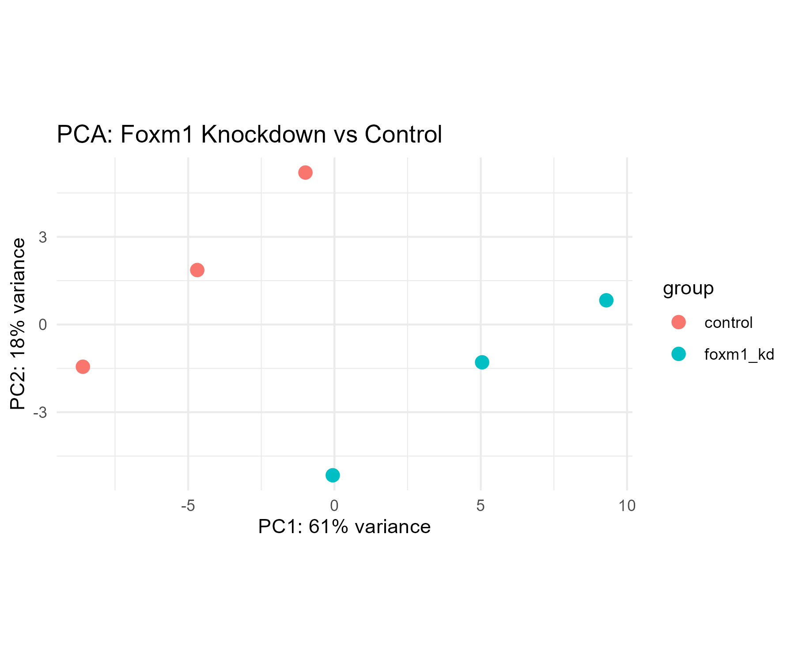
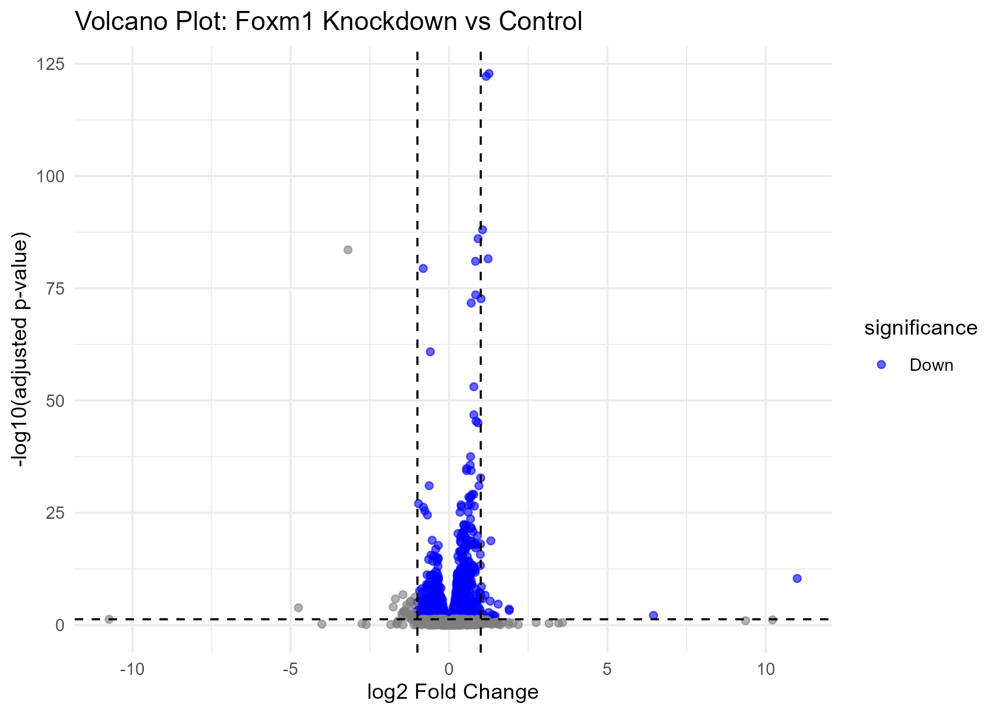

# GSE234443 Foxm1 Knockdown RNA-seq Analysis
## Background
FOXM1 (Forkhead Box M1) is a transcription factor that plays a key role in cell cycle regulation, proliferation, and DNA damage repair. It is frequently overexpressed in cancer and in associated with tumor progression, making it a relevant target for understanding gene regulatory networks in  disease contexts. This project investigates the transcriptional consequences of FOXM1 knockdown using RNA-seq data.
## Data
- **Source:** [GEO Series GSE234443](https://www.ncbi.nlm.nih.gov/geo/query/acc.cgi?acc=GSE234443)
- **Design:** FOXM1 siRNA knockdown vs. negative control siRNA
- **Replicates:** 3 biological replicates per group
- **Note:** Raw count data were obtained from GEO supplementary files, as the series matrix did not contain expression data.
## Workflow 
1. **Data retrieval** - Downloaded raw count data using the 'GEOquery' package.
2. **Preprocessing** - CLeaned duplicate gene symbols by aggregating counts.
3. **Differential expression analysis** - Performed using 'DESeq2' to compare FOXM1 knockdown vs. control.
4. **Output generation** - Saved differantial expression results as a CSV file and the DESeq2 dataset object as an RDS file.
5. **Visualization** - Generated PCA and volcano plots to assess sample clustering and significant gene expression changes.
## Repository Structre 
data/- Raw counts and DESeq2 dataset object (dds.rds)
scripts/ - Analysis scripts (R)
results/ - DESeq2 output (CSV) and plots (PCA, volcano)
## Key Results

Differential expression analysis identified genes significantly altered upon FOXM1 knockdown (padj < 0.05, |log2FC| > 1). The PCA plot shows clear separation between knockdown and control samples, and the volcano plot highlights the most significantly up- and down-regulated genes.
## How to Reproduce
**Requirements:** R (≥ 4.0), Bioconductor packages: 'GEOquery', 'DESeq2', 'ggplot2'
'''r
install.packages("BiocManager")
BiocManager::install(c("GEOquery", "DESeq2"))
install.packages("ggplot2")
'''
Run the analysis scripts in the `scripts/` folder in order to reproduce the full pipeline from data retrieval to differential expression results.
## Tools & Skills
R, Bioconducter (GEOquery, DESeq2), ggplot2, RStudio, Git/GitHub
